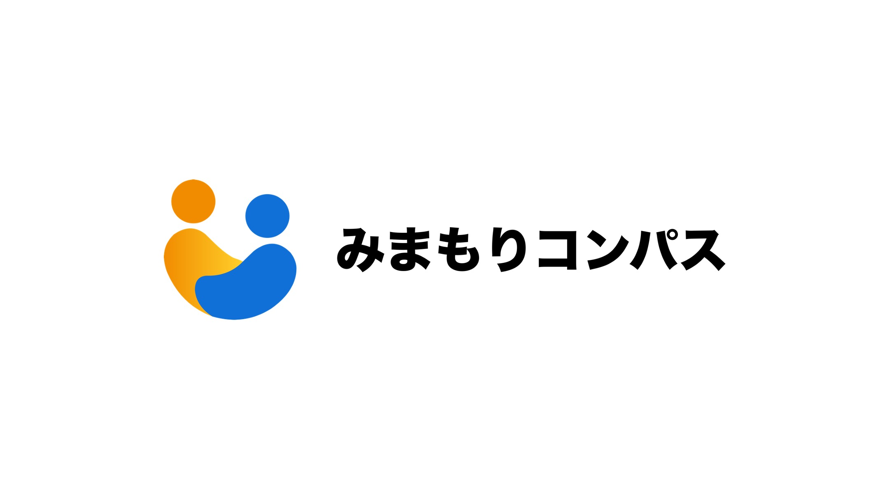

# みまもりコンパス


## プロジェクト概要

認知症高齢者の「もしも」を、地域全体で支えるWebアプリケーション。

「みまもりコンパス」は、徘徊や行方不明のリスクを抱える認知症高齢者を早期に発見し、迅速な対応を可能にするための革新的なプラットフォームです。本人が身につけるユニークなQRコードを通じて、発見者が手軽に情報を共有し、家族への即時通知、さらにはSNSを活用した地域連携を促進します。私たちは、地域社会の温かい眼差しで、大切な命を守る仕組みを創造します。

## 社会課題と目的

認知症による徘徊は、ご家族にとって計り知れない不安と負担をもたらし、時に深刻な事故につながる社会的な課題です。現状の捜索体制では、早期発見が困難なケースも少なくありません。

「みまもりコンパス」は、この課題に対し、**地域住民が「QRコードを読み取るだけ」で支援に参加できる**シンプルな仕組みを提供します。これにより、迅速な情報共有と対応を実現し、認知症高齢者とそのご家族に「安心」を届けます。

## 主な機能

-   **QRコード発行機能**:
    -   認知症高齢者一人ひとりに固有のQRコードを生成。身につけることで、迅速な身元確認を可能にします。

-   **発見者報告機能**:
    -   QRコードを読み取ると、本人のプロフィールページへ遷移。
    -   発見者は以下の状況を選択して報告できます:
        -   `一緒に待機している`
        -   `警察に引き渡した`
        -   `報告のみ（居場所のみ）`

-   **リアルタイム通知機能**:
    -   発見報告があった際、ご家族へ位置情報、時刻、発見者からのメモなどを即座に通知します。

-   **チャット機能**:
    -   発見者とご家族がアプリ上で直接、安全にコミュニケーションを取ることができます。

-   **SNS連携・共有ページ生成**:
    -   ご家族がワンクリックでSNS（X/Twitter）に投稿できる、動的な共有ページを自動生成。
    -   地域全体への協力をスムーズに呼びかけます。

## 技術スタック

-   **フレームワーク**: Next.js 15.2.4
-   **言語**: TypeScript
-   **認証**: Firebase Authentication
-   **データベース**: Firebase Firestore
-   **チャット**: Firebase Realtime Database または Firestore
-   **ホスティング**: Vercel
-   **UI**: React 19, Tailwind CSS 4, shadcn/ui, lucide-react
-   **フォーム**: React Hook Form + Zod
-   **スタイリング**: Tailwind CSS + PostCSS + `tw-animate-css`
-   **リント**: ESLint
-   **パッケージ管理**: npm

## 開発手順（ローカル環境構築）

```bash
# パッケージインストール
npm install

# 環境変数ファイルを作成
cp .env.local.example .env.local
# FirebaseのAPIキーなどを設定

# 開発サーバー起動
npm run dev
```

## ビルドとデプロイ

```bash
# 本番ビルド
npm run build

# 本番サーバー起動
npm run start

# Lintチェック
npm run lint
```

**推奨デプロイ先**: [Vercel](https://vercel.com)

```